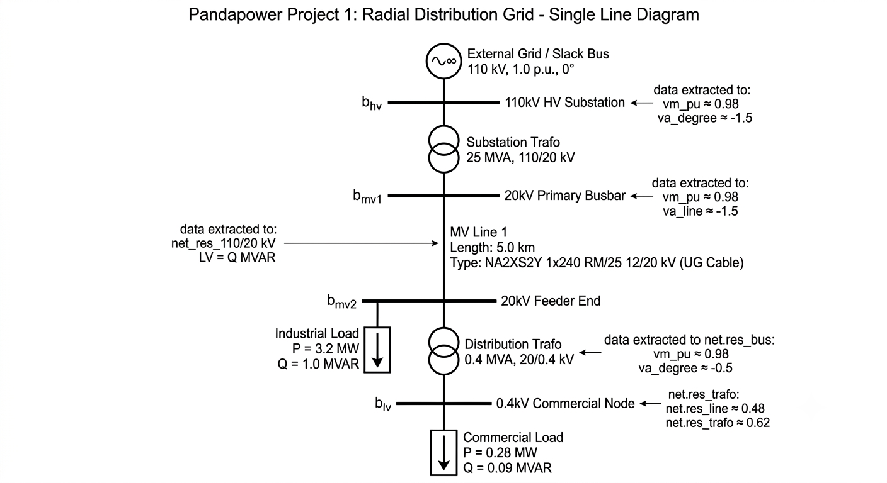

# Radial Distribution Grid Modeling & AC Power Flow Analysis

A Python-based power system modeling project using **pandapower** to build, simulate, and analyze a multi-voltage radial distribution network ($110\text{ kV} / 20\text{ kV} / 0.4\text{ kV}$). 

This repository executes a non-linear AC Newton-Raphson load flow calculation, evaluates voltage profiles across nodes, checks thermal loading limits on lines and transformers, and automatically flags grid code violations.

---

## 📌 Project Features
* **Multi-Voltage Level Network Topology:** Models sub-transmission ($110\text{ kV}$), medium-voltage distribution ($20\text{ kV}$), and low-voltage commercial feeder ($0.4\text{ kV}$) levels.
* **Standard Equipment Library Integration:** Utilizes pre-validated manufacturer types for underground cables (`NA2XS2Y`) and transformers (`25 MVA` and `0.4 MVA`).
* **Newton-Raphson AC Power Flow:** Solves non-linear power balance equations ($\mathbf{Y}_{\text{bus}}$ matrix) to extract nodal state variables ($|V|, \theta$) and branch flows ($P, Q, I$).
* **Automated Violation Diagnostic Script:** Programmatically screens system output for undervoltage conditions ($V < 0.95\text{ p.u.}$) and equipment thermal overloads ($I_{\text{loading}} > 100\%$).

---

## 📐 Network Architecture & Parameters

### Single-Line Topology Overview


### Component Parameters
| Component | Type / Standard | Key Parameters |
| :--- | :--- | :--- |
| **Slack Bus** | External Grid Connection | $V = 1.00\text{ p.u.}, \theta = 0.0^\circ$ |
| **Substation Trafo** | `25 MVA 110/20 kV` | $S_n = 25\text{ MVA}, 110\text{ kV} \rightarrow 20\text{ kV}$ |
| **MV Cable Line** | `NA2XS2Y 1x240 RM/25 12/20 kV` | Length = $8.5\text{ km}$, Underground Cable |
| **Industrial Load** | $PQ$ Bus Load | $P = 3.5\text{ MW}, Q = 1.2\text{ MVAR}$ |
| **Distribution Trafo**| `0.4 MVA 20/0.4 kV` | $S_n = 0.4\text{ MVA}, 20\text{ kV} \rightarrow 0.4\text{ kV}$ |
| **Commercial Load** | $PQ$ Bus Load | $P = 0.30\text{ MW}, Q = 0.10\text{ MVAR}$ |

---

## ⚡ Mathematical Background

The calculation engine forms the complex Nodal Admittance Matrix $\mathbf{Y}_{\text{bus}} = \mathbf{G} + j\mathbf{B}$ and iteratively solves for nodal state variables using the Newton-Raphson method:

$$P_i = \sum_{j=1}^{N} |V_i||V_j|(G_{ij}\cos\theta_{ij} + B_{ij}\sin\theta_{ij})$$

$$Q_i = \sum_{j=1}^{N} |V_i||V_j|(G_{ij}\sin\theta_{ij} - B_{ij}\cos\theta_{ij})$$

Convergence is reached when maximum power mismatch falls below $\epsilon = 10^{-6}\text{ MVA}$.

---

## 🛠️ Installation & Setup

1. **Create a Virtual Environment (Optional but Recommended):**
   ```bash
   python -m venv venv
   source venv/bin/activate  # On Windows: venv\Scripts\activate
   ```

2. **Install Requirements:**
   ```bash
   pip install pandapower pandas
   ```

---

## 🚀 Usage & Execution

Run the main network simulation script:

### Script Structure (`main.py`)
```python
import pandapower as pp

def run_basic_grid_analysis():
    # 1. Initialize Network
    net = pp.create_empty_network(name="Radial_Distribution_Grid")

    # 2. Add Buses
    b_hv  = pp.create_bus(net, vn_kv=110.0, name="110kV HV Substation")
    b_mv1 = pp.create_bus(net, vn_kv=20.0,  name="20kV Primary Busbar")
    b_mv2 = pp.create_bus(net, vn_kv=20.0,  name="20kV Feeder End")
    b_lv  = pp.create_bus(net, vn_kv=0.4,   name="0.4kV Commercial Node")

    # Slack Node
    pp.create_ext_grid(net, bus=b_hv, vm_pu=1.00, va_degree=0.0, name="Grid Slack")

    # 3. Add Transformers and Lines
    pp.create_transformer(net, hv_bus=b_hv, lv_bus=b_mv1, std_type="25 MVA 110/20 kV", name="Substation Trafo")
    pp.create_line(net, from_bus=b_mv1, to_bus=b_mv2, length_km=8.5, std_type="NA2XS2Y 1x240 RM/25 12/20 kV", name="MV Line 1")
    pp.create_transformer(net, hv_bus=b_mv2, lv_bus=b_lv, std_type="0.4 MVA 20/0.4 kV", name="Distribution Trafo")

    # 4. Add Loads
    pp.create_load(net, bus=b_mv2, p_mw=3.5, q_mvar=1.2, name="Industrial Load")
    pp.create_load(net, bus=b_lv, p_mw=0.30, q_mvar=0.1, name="Commercial Load")

    # 5. Execute Power Flow
    pp.runpp(net)

    # 6. Violations Check
    user_input = input("""what do you wanna see?
1. voltage magnitude of each bus.
2. line thermal loading.
3. Output Diagnostic Alerts of low voltages
 """)
    if user_input == "1" :    
        print("=== BUS VOLTAGE MAGNITUDES (p.u.) ===")
        print(net.res_bus[['vm_pu']])
    elif user_input == "2" :    
        print("\n=== LINE THERMAL LOADING (%) ===")
        print(net.res_line[['loading_percent']])
    elif user_input == "3" :    
        # Output Diagnostic Alerts
        low_v = net.res_bus[net.res_bus['vm_pu'] < 0.95]
        if not low_v.empty:
                print(f"\n[ALERT] Undervoltage violation on bus indices: {list(low_v.index)}")
        else : print("no low voltages alert at any bus")
    else: print("wrong output")
while __name__ == "__main__":
    run_basic_grid_analysis()```

---

## 📊 Extracted Output Tables

After execution, data can be queried directly from `pandapower` result tables:

* **`net.res_bus`**: Nodal voltage magnitudes ($V_{\text{mag}}$ in $\text{p.u.}$) and phase angles ($\theta$ in degrees).
* **`net.res_line`**: Cable thermal loading percentage ($\%$), current magnitude ($I$ in $\text{kA}$), active ($P_{\text{loss}}$), and reactive ($Q_{\text{loss}}$) line losses.
* **`net.res_trafo`**: Transformer active/reactive throughput and thermal utilization percentages.
* **`net.res_ext_grid`**: Real ($P$) and reactive ($Q$) power drawn from the main transmission grid to cover loads + total network losses.
